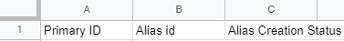

# GoogleWorkspace-CreateAlias
Google Apps Script to creates email aliases for Google Workspace users in bulk, from a Google Sheet

This script is intended for Google Workspace admins to bulk-add aliases from a Google Sheet. While Google Admin Console allows this functionality already, it only creates aliases if their user's email prefix before the @ is the same; with this script, you can bulk-add aliases with varying prefixes.

### Requirements

The user running the script must be a Super Admin in Google Workspace.

### Installation and Use

1. Create a new Google Sheet named __Create Alias__ \*
2. For A1 enter __Primary ID__ - for B1 enter __Alias id__ - for C1 enter __Alias Creation Status__

3. Enter the Primary user IDs and the desired aliases in the appropriate columns.
4. Click Tools - Script Editor.
5. On the Editor view, copy and paste the contents of [CreateAlias.js](CreateAlias.js). From the services menu, enable AdminDirectory directory_v1.
6. Press run and accept the OAuth prompt. If all went well, the status column in the Sheet will fill in with *Alias Created Successfully*

\* (if you want a different name for the Sheet, you must change the file reference on line #5)

